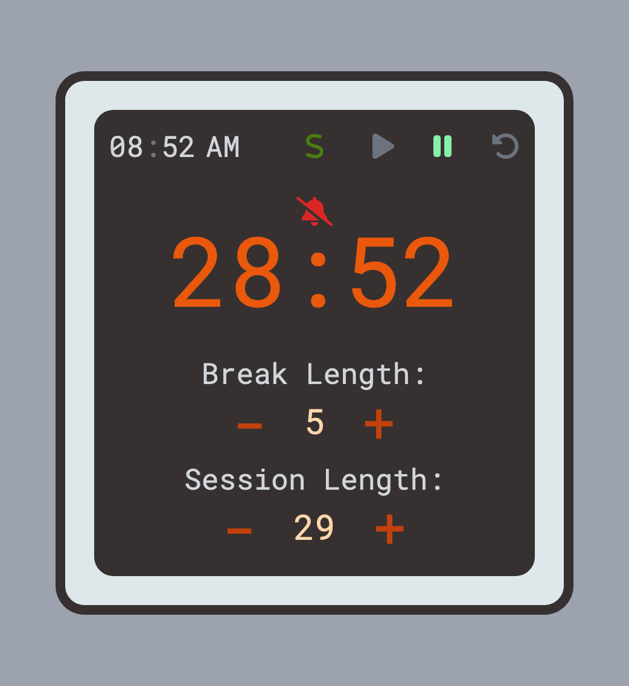

# Session Timer

Session Timer helps you riding high on your productivity momentum. Also, it reminds to take regular breaks to recharge your mind and hydrate your body.

### Next Feature To Add

- A backend support to track your session records.
- Visualized sessions overview.

## Table of Content

- [About](#about)
  - [Features](#features)
  - [Links](#links)
  - [Screenshots](#screenshots)
  - [Built With](#built-with)
- [Author](#author)

## About

### Features

- Intuitive buttons and elegant status prompt to help you navigate.
- Real time at the top left corner to help you stay in contact with the reality.
- Clear visual and audio prompt(can be muted) to help you get off/back on track.

### Links

- Live Site URL: [Github page](https://llhyuan.github.io/session-timer/)

### Screenshots

### Built with

- React
- Tailwind Css
- Flexbox
- Mobile-first workflow
- [React](https://reactjs.org/) - JS library

## Author

- LinkedIn - [Hangyuan Liu](www.linkedin.com/in/hangyuan-liu-a9282718b)
